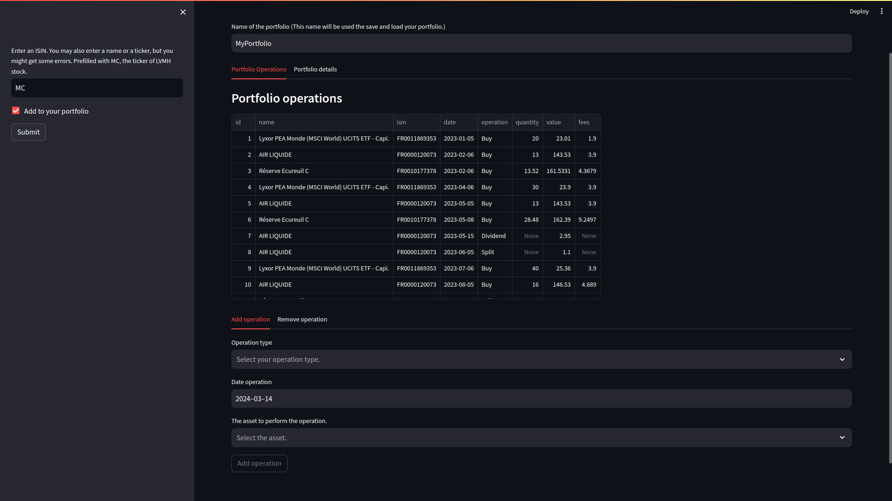
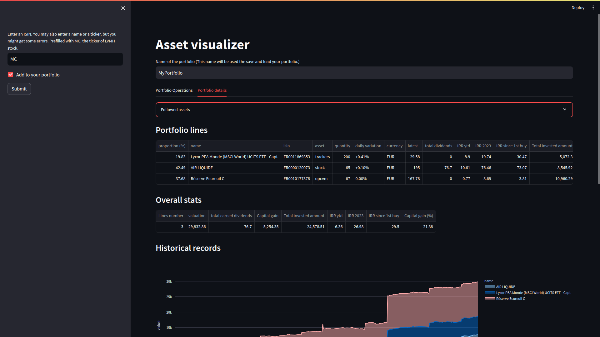
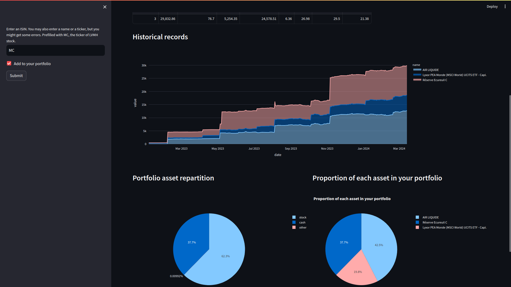

# Table of Contents

1.  [Financial data](#org5c67bbb)
2.  [Portfolio class](#org8891bb0)
3.  [Streamlit](#orgb7bb8c5)
4.  [Tests](#orga8e13fb)
5.  [Next steps](#orgf7dc133)

# Financial data

-   Use boursorama.com website
-   Better to use an API, but as it is a simple project, navigating the source code is the way because it is free.

# Portfolio class

-   Aggregate financial data in an instance of Portfolio object
-   Give stats (XIRR, quantity, dividends, quotes), charts about the assets of your portfolio/tracked assets
-   Give stats of your overall portfolio.
-   Three available periods of time for the XIRR: Year-to-Date (Ytd), last Year, since inception

# Streamlit

-   Use streamlit to run the webapp
-   run it by opening a terminal at the project locationby typing `streamlit run app.py`

Some screenshots :

-   Operation tab

-   Portfolio tab

# Tests

To run tests: run in a terminal the following `python tests/unit_tests.py`

# Next steps

-   Add a way to configure data for SCPIs
-   Add manual assets, e.g. Deposit account
-   Import operations from csv, pdf

